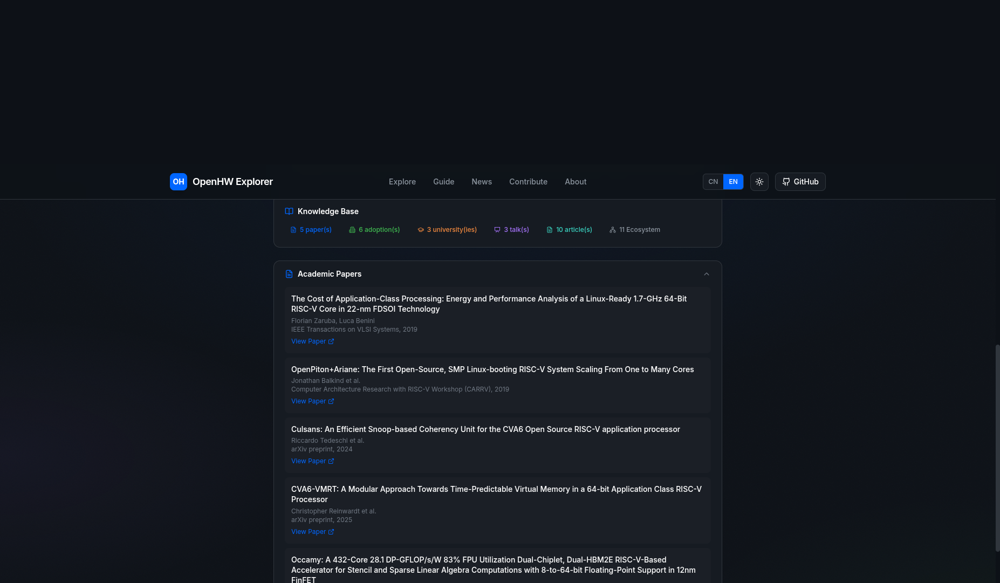

# OpenHW Explorer

[](LICENSE)
[](https://nextjs.org/)
[](https://www.typescriptlang.org/)
[](https://www.openhwgroup.org/)

A community-built navigator for [OpenHW Group](https://www.openhwgroup.org/) repositories — helping engineers, students, and researchers find the right RISC-V open-source project faster.

> **Disclaimer:** This is an independent community project, not affiliated with or endorsed by OpenHW Group.



---

## Features

- **Quick Filters** — one-click filtering by category: Cores, Verification, Tools, Docs, Learning
- **Smart Navigator** — multi-dimensional filtering by user role, core type, and verification method
- **Knowledge Base** — curated context: academic papers, industry adoption, presentations, and ecosystem links for each repo
- **Contribution Hub** — guided workflow for adding projects or fixing data quality issues
- **Bilingual UI** — full English and Chinese interface via `next-intl`
- **Data Pipeline** — scripts to refresh GitHub stats and curate news digests

## Quick Start

**Requirements:** Node.js 18+

```bash
git clone https://github.com/<your-username>/openhw-explorer.git
cd openhw-explorer
npm install
npm run dev
# Open http://localhost:3000
```

Build for production:

```bash
npm run build
npm start
```

Deploy to [Vercel](https://vercel.com/) in one click — import the repo and it deploys automatically.

## Data Refresh

GitHub stats and news digests are pre-built at deploy time. To refresh locally:

```bash
# Fetch latest GitHub stars, forks, and language data
npm run fetch-data

# Rebuild the news digest
npm run build-news

# Validate data quality
npm run check:data-quality
```

Set `GITHUB_TOKEN` in your environment to avoid API rate limits:

```bash
export GITHUB_TOKEN=ghp_your_token_here
```

## Adding a Project

Edit `src/data/projects.ts` and add an entry to the `projects` array:

```typescript
{
  id: "my-project",
  name: "My Project",
  description: "One or two sentences describing what it does and who it is for.",
  category: ["core"],
  coreType: ["embedded-mcu"],
  tags: ["RISC-V", "SystemVerilog"],
  status: "active",
  github: "https://github.com/openhwgroup/my-project",
  stars: 0,
  language: "SystemVerilog",
  suitableFor: ["student", "engineer"],
}
```

See `src/types/index.ts` for the full type definition and all available field values.

## Tech Stack

| Library | Version | Purpose |
|---------|---------|---------|
| Next.js | 14 | Framework, App Router |
| React | 18 | UI |
| TypeScript | 5 | Type safety |
| Tailwind CSS | 4 | Styling |
| next-intl | 4 | i18n (EN/ZH) |
| Fuse.js | 7 | Client-side search |
| Lucide React | — | Icons |

## License

Apache License 2.0 — see [LICENSE](LICENSE) for details.

Copyright 2026 Alex Chen

---

## 中文说明

OpenHW Explorer 是一个社区构建的 OpenHW Group 项目导航工具，帮助工程师、学生和研究人员快速定位所需的 RISC-V 开源项目和资源。

> **声明**：本项目为独立社区项目，与 OpenHW Group 官方无关联。

### 快速开始

```bash
git clone https://github.com/<your-username>/openhw-explorer.git
cd openhw-explorer
npm install
npm run dev
# 打开 http://localhost:3000
```

### 主要功能

- **快速筛选**：一键按分类筛选（核心、验证、工具、文档、学习资源）
- **智能导航**：按用户角色、核心类型、验证方式多维筛选
- **知识库**：每个项目附带学术论文、行业应用、演讲、生态链接等上下文信息
- **贡献中心**：引导式工作流，便于添加项目或修正数据质量问题
- **双语界面**：完整中英文界面支持

### 添加项目

编辑 `src/data/projects.ts`，在 `projects` 数组中新增条目。字段定义见 `src/types/index.ts`。

### 数据刷新

```bash
npm run fetch-data       # 刷新 GitHub 统计数据
npm run build-news       # 重建新闻摘要
npm run check:data-quality  # 数据质量验证
```

### 贡献

欢迎提交 PR！详情见 [CONTRIBUTING.md](CONTRIBUTING.md)。

### 相关链接

- [OpenHW Group 官网](https://www.openhwgroup.org/)
- [OpenHW GitHub 组织](https://github.com/openhwgroup)
- [RISC-V 国际基金会](https://riscv.org/)
